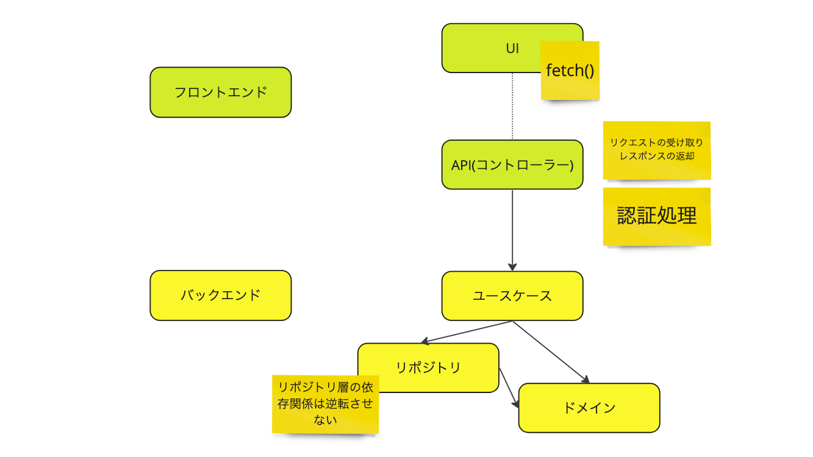

# README

## クローンしたときにすること

- `npm install`
- env.template をコピーしてファイル名を.env にする

## 作業毎にすること

- `npm run docker:start`

## コーディング規約

##### 全般

`eslint-plugin-import-access`を採用しています。  
これはコロケーションを強制する EsLint のプラグインです。使い方は以下を御覧ください  
[uhyo/eslint-plugin-import-access](https://github.com/uhyo/eslint-plugin-import-access)

##### src/app(/api 除く)

- フロントエンドのコードを記述すること
- ドメイン周りのルールや DB 周りはバックエンド側で処理するので書かない
- pages.tsx には全体を見渡せるようにコードを書く
- \_components には pages.tsx からコンポーネントを分割したものを記述する
- \_components は/〇〇/index.tsx のような形で書く
- \_components は storybook 必須
- \_storybook を作る上でロジックが邪魔なら、`index.presenter.tsx`, `index.container.tsx`のように分割する
- `@Public`禁止

##### src/app/api

- バックエンドのコードのうちコントローラー層に相当する
- やることは以下のとおり
  - 認証処理(必要なら)
  - ユースケースの実行
  - レスポンスの返却
  - エラーログの送信
  - `@Public`禁止

##### src/backend

- バックエンドのコードを記述すること
- ドメイン層、ユースケース層、リポジトリ層のテスト必須
- ユースケース層は実質結合テストになる
- ユースケース層のみ`@Public`を許可する。というか`@public`にしないといけない

##### src/**shared**

- 共通コード
- すべてのファイルに`@Public`をつける

## テスト規約

以下のように書くこと

- テストファイルは`〇〇.test.ts`のようにする
- describe はクラス名もしくは関数名を記述する
- test は〇〇のとき、✕✕ すべきという形で記述する

```ts
describe("jest-prisma-check", () => {
  test("userテーブルが存在するとき、trueを返すべき", async () => {
    const count = await db.user.count();
    expect(count >= 0).toBe(true);
  });
});
```

[Jest の Tips 集 10 選。サーバーサイドで Node.js の Jest を書いたことない人向け](https://zenn.dev/kanasugi/articles/b49bd464311053)

## バックエンド詳細

- オニオンアーキテクチャーベース
- ただし、リポジトリ層の依存関係は逆転させていない
  - (必要性を感じないので)
  - 

##### ドメイン層

- ドメイン知識の実装をする
- 依存してはならない
- 集約ルートからしか、エンティティや値オブジェクトは触らない。
- 集約ルート以外から触るときは、集約ルートのメソッドを使う

##### ユースケース層

- アプリケーションの組み立て
- ドメイン層とリポジトリ層に依存して良い。(正確にいうと、集約ルートに依存する)
- 各層の中で最もリファクタが容易なので手続き的に書いてもよい。

##### リポジトリ層

- DB 処理
- ドメイン層のみ依存指定良い

##### コントローラー層(/api)

- フロントエンドとユースケースの橋渡し
- ユースケースのみ依存して良い

##### DB まわりメモ

- 複数の更新の整合性を担保したい場合
  - ユースケース層でロングトランザクションを実行すること
  - ```ts
    this.prisma.$transaction(async (trn: TransactionClient) => {
      // データを更新
      await this.repository1.save(trn, _address);
      // データを更新
      await this.repository2.save(trn, _address);
    });
    ```
- 少し込み入った参照(select)をしたい場合
  - `useCase`に直接書いていい。
  - 理由として
    1. 画面の関心事とドメインの関心事は違うから
    2. リポジトリ層に記述するとリポジトリ層が永遠と肥大化していってしまい、メンテナンスが困難になるから
    3. ユースケース層なら汚くなっても修正が効くから
    4. 整合性を担保する必要がないから

## 例外処理

##### フロントエンド

- 受け取ったレスポンスにユーザー向けのエラーメッセージがあれば、それをトーストで表示する
- なければエラーコードからエラーメッセージを作成してトーストで表示する

##### バックエンド

- 各層で発生した例外はコントローラー層で受け取る(コントローラー層のみ`tryCatch文`を実行できる)
- コントローラー層の catch 文中はログ解析できるように、必要な情報を`console.error`に出力する(ユーザー ID やリクエストデータなど)
- console.log と throw new Error()が自動的に CloudLogging に出力される
- (きっちりやるなら Result 型を用いて想定しうるエラーをコントローラー層にリフトアップしていって、ユーザーにエラーメッセージを返してもいいかも)

## フロントエンドからユースケースまでの流れ

フロントエンド側

```tsx
export const AddressForm = () => {
  // ドメインは開発とステージングと本番で異なるので、環境変数から取得する
  const url = `${env.NEXT_PUBLIC_ORIGIN}/api/address`;
  const { toast } = useToast();
  // React Hook Form + zod の設定をする
  const form = useForm<z.infer<typeof addressFormSchema>>({
    resolver: zodResolver(addressFormSchema),
    defaultValues: initialAddress,
  });
  // 略

  // 送信処理
  const onSubmit = async (values: z.infer<typeof addressFormSchema>) => {
    // ユースケース層に記述したリクエストの型を用いて、bodyを作成する
    // API層(コントローラー層)では型チェックしないので、body作成時に型をつける
    // 理由：
    // 1. API層(コントローラー層)で型チェックするのが面倒臭い
    // 2. そのうちServerActionが使えるようになるからここにコストを裂きたくない
    // 3. 型間違いは動作確認で簡単にわかるから
    const _body: ISaveAddressRequest = {
      postalCode: values.postalCode,
      prefecture: values.prefecture,
      city: values.city,
      town: values.town,
      block: values.block,
    };
    // json型では送信できないので、string型に変換する
    const body = JSON.stringify(_body);
    // 送信する、ここでAPIが実行される
    const response = await fetch(url, { method: "POST", body: body });
    // エラーハンドリングをする
    if (!response.ok) {
      const json = await response.json();
      // エラーメッセージの型は{message:string}で統一する
      toast({ description: json.message, variant: "error" });
      throw new Error(json.message);
    }
    // 返り値が特にない場合、API層(コントローラー層)では{message:string}を返す
    toast({ description: json.message, variant: "success" });
  };

  return (
    <Form {...form}>
      <form onSubmit={form.handleSubmit(onSubmit)}>
        <FormField
        // 略
        />
        <FormField
        // 略
        />
        <FormField
        // 略
        />
        <Button type="submit">Submit</Button>
      </form>
    </Form>
  );
};
```

API 層(コントローラー層)

```ts
export async function POST(req: Request) {
  // try-catch外でbodyを取得するのは、bodyをcatch句で使うため
  const body: ISaveAddressRequest = await req.json();
  try {
    // ログイン必須なら、ユーザーがログインしているか確認する
    // ログインしていない場合、エラーレスポンスを返す
    // エラーの返り値は401
    const user = await getCurrentUser();
    if (!user) return createErrResponse(401, "ログインしてください");

    // ユースケースの実行
    const useCase = new SaveAddress(db);
    await useCase.execute({ ...body, userId: user.id });

    // レスポンス(特に返り値がない場合)
    return createSimpleResponse(201, "住所を登録しました");
    // 返り値がある場合はこんな感じにする
    // const response = await useCase.execute(user.id);
    // const returnValue = JSON.stringify(response);
    // return new Response(returnValue, { status: 200 });
  } catch (e) {
    // ログをCloudLoggingに送る
    const user = await getCurrentUser();
    console.error({ userId: user ? user.id : "-", body: body, error: e });
    return createErrResponse(500, "サーバーエラーが発生しました");
  }
}
```

## メモ

- なぜユースケースに prisma を外部から渡すか
